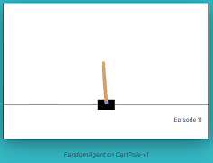
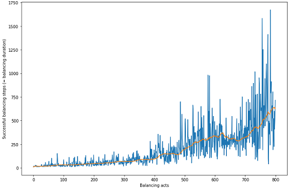

# Reinforcement learning - an introduction

### Intended audience 

This notebook is for you if you are relatively (or completely) new to reinforcement learning and want to know, how reinforcement learning works on a technical level. It would be quite helpfull, if you already have some experience with: 
* Neural networks
* Pytorch

### Overview
This notebook shows, how to train a neural network to balance a pole on a cart. For this we are using a "prefabricated environment" provided by OpenAI: [The Cart pole environment](https://gym.openai.com/envs/CartPole-v1/).    

    
Please have a look at https://gym.openai.com/envs/CartPole-v1/ for more details - especially about the properties of the observation and action space.    
By using unsupervised reinforcement learning the model is learning to balance better and better by using a neural network:    
    
 
       
### Technical preconditions
There are basically two technical preconditions for running this notebook:
* `Pytorch` has to be installed (see https://pytorch.org/  for installation notes)
* `Gym` has to be installed (see https://gym.openai.com/docs/#installation for installation notes)
* Important note: There is no GPU needed for running this code   
 
